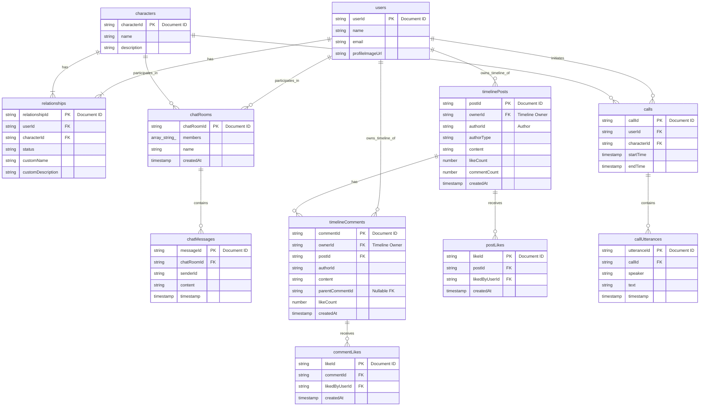

Firebase 기반 DB 설계 문서 (최종 개선안)

이 문서는 확장성과 NoSQL 데이터베이스의 장점을 극대화하기 위해 개선된 Firebase Firestore 데이터베이스 구조를 상세히 기술합니다. 핵심 목표는 효율적인 쿼리, 데이터 무결성 유지, 그리고 향후 기능 확장에 유연하게 대처할 수 있는 기반을 마련하는 것입니다.

## 핵심 설계 원칙

1. **평탄한 데이터 구조 (Flat Data Structure)**: 데이터를 깊게 중첩하지 않고, 최상위 컬렉션들을 평탄하게 유지합니다. 이를 통해 각 데이터 유형을 독립적으로 쿼리할 수 있어 유연성이 향상되고, 문서 크기 제한(1MB) 문제를 예방하며, 불필요한 데이터 로딩을 방지하여 비용과 성능을 최적화합니다.
2. **참조를 통한 관계 설정**: 각 컬렉션은 문서 ID(예: `userId`, `postId`)를 필드로 저장하여 다른 컬렉션의 문서를 논리적으로 참조합니다. 이는 관계형 데이터베이스의 외래 키(Foreign Key)와 유사한 역할을 합니다.
3. **성능을 위한 비정규화 (Denormalization)**: `timelinePosts` 문서에 `likeCount`와 `commentCount`를 저장하는 것처럼, 읽기 성능을 최적화해야 하는 경우 계산된 값을 중복 저장합니다. 이는 복잡한 집계 쿼리를 피하게 해주어 빠르고 비용 효율적인 데이터 조회를 가능하게 합니다.
4. **명확한 데이터 소유권**: `timelinePosts`, `timelineComments` 등의 컬렉션에 `ownerId` 필드를 도입하여, 해당 데이터가 **누구의 타임라인에 표시되어야 하는지** 명확히 구분합니다. 이는 실제 작성자를 나타내는 `authorId`와는 별개의 개념으로, 서비스의 핵심 로직을 명확하게 만듭니다.
5. **확장 가능한 커스텀 기능**: 사용자가 캐릭터를 커스터마이징하는 정보는 `characters` 문서를 직접 수정하는 대신, `relationships` 컬렉션 내의 사용자-캐릭터 관계 문서에 저장합니다. 이를 통해 원본 캐릭터 정보를 훼손하지 않으면서 사용자별 맞춤 설정을 무한히 확장할 수 있습니다.
6. **대댓글 지원**: `timelineComments`에 `parentCommentId` 필드를 추가하여 무한 깊이의 대댓글 구조를 클라이언트에서 효율적으로 구현할 수 있도록 지원합니다.

---

## 컬렉션 및 문서 구조

#### `users`

- **설명**: 사용자 정보를 저장합니다.
- **문서 ID**: `userId` (Firebase Authentication에서 제공하는 UID 사용)
- **필드**:
  - `email`: `string` (사용자 이메일, 고유 식별자)
  - `name`: `string` (사용자 이름 또는 닉네임)
  - `profileImageUrl`: `string` (프로필 이미지 URL)

#### `characters`

- **설명**: 모든 AI 캐릭터의 기본 정보를 저장합니다. 이 데이터는 모든 사용자에게 공통으로 제공되는 원본입니다.
- **문서 ID**: `characterId` (관리자가 정의하는 고유 ID 또는 자동 생성 ID)
- **필드**:
  - `name`: `string` (캐릭터 기본 이름)
  - `description`: `string` (캐릭터 기본 설명)

#### `relationships`

- **설명**: 사용자와 캐릭터 간의 관계 및 **사용자별 커스텀 정보**를 저장합니다.
- **문서 ID**: 자동 생성 ID
- **필드**:
  - `userId`: `string` (참조: `users` 컬렉션)
  - `characterId`: `string` (참조: `characters` 컬렉션)
  - `status`: `string` (관계 상태, 예: "customized", "using_default", "not_using")
  - `customName`: `string` (상태가 "customized"일 경우 사용자가 지정한 이름)
  - `customDescription`: `string` (상태가 "customized"일 경우 사용자가 지정한 설명)

#### `chatRooms`

- **설명**: 특정 사용자와 캐릭터 간의 1:1 채팅방 정보를 저장합니다.
- **문서 ID**: 자동 생성 ID
- **필드**:
  - `members`: `array<string>` (채팅방 참여자 ID 목록. 항상 `[userId, characterId]` 형태)
  - `name`: `string` (채팅방 이름, 예: "철수와 AI 비서")
  - `createdAt`: `timestamp` (채팅방 생성 시간)

#### `chatMessages`

- **설명**: 채팅방의 모든 메시지를 시간 순서대로 저장합니다.
- **문서 ID**: 자동 생성 ID
- **필드**:
  - `chatRoomId`: `string` (참조: `chatRooms` 컬렉션)
  - `senderId`: `string` (발신자 ID, `userId` 또는 `characterId`)
  - `content`: `string` (메시지 내용)
  - `timestamp`: `timestamp` (메시지 전송 시간)

#### `timelinePosts`

- **설명**: 타임라인에 표시될 모든 게시물을 저장합니다. 사용자와 캐릭터 모두 작성할 수 있습니다.
- **문서 ID**: 자동 생성 ID
- **필드**:
  - `ownerId`: `string` (**이 게시물이 표시될 타임라인의 소유자** `userId`. 참조: `users` 컬렉션)
  - `authorId`: `string` (게시물의 실제 작성자 ID, `userId` 또는 `characterId`)
  - `authorType`: `string` (작성자 유형: "user" 또는 "character")
  - `content`: `string` (게시물 내용)
  - `imageUrl`: `string` (이미지 URL, 선택 사항)
  - `likeCount`: `number` (좋아요 수, 비정규화된 값)
  - `commentCount`: `number` (댓글 수, 비정규화된 값)
  - `createdAt`: `timestamp` (게시물 생성 시간)

#### `timelineComments`

- **설명**: 타임라인 게시물에 대한 댓글 및 대댓글을 저장합니다.
- **문서 ID**: 자동 생성 ID
- **필드**:
  - `ownerId`: `string` (상위 게시물이 속한 타임라인의 소유자 `userId`. 참조: `users` 컬렉션)
  - `postId`: `string` (상위 게시물 ID. 참조: `timelinePosts` 컬렉션)
  - `authorId`: `string` (댓글 작성자 ID, `userId` 또는 `characterId`)
  - `content`: `string` (댓글 내용)
  - `likeCount`: `number` (좋아요 수, 비정규화된 값)
  - `parentCommentId`: `string` (대댓글인 경우 부모 댓글의 ID, 최상위 댓글은 `null`)
  - `createdAt`: `timestamp` (댓글 생성 시간)

#### `postLikes`

- **설명**: 게시물 좋아요 정보를 저장하여 누가 어떤 게시물에 좋아요를 눌렀는지 추적합니다.
- **문서 ID**: 자동 생성 ID
- **필드**:
  - `postId`: `string` (참조: `timelinePosts` 컬렉션)
  - `likedByUserId`: `string` (좋아요를 누른 사용자 ID. 참조: `users` 컬렉션)
  - `createdAt`: `timestamp` (좋아요 누른 시간)

#### `commentLikes`

- **설명**: 댓글 좋아요 정보를 저장하여 누가 어떤 댓글에 좋아요를 눌렀는지 추적합니다.
- **문서 ID**: 자동 생성 ID
- **필드**:
  - `commentId`: `string` (참조: `timelineComments` 컬렉션)
  - `likedByUserId`: `string` (좋아요를 누른 사용자 ID. 참조: `users` 컬렉션)
  - `createdAt`: `timestamp` (좋아요 누른 시간)

#### `calls`

- **설명**: 사용자와 캐릭터 간의 통화 기록을 저장합니다.
- **문서 ID**: 자동 생성 ID
- **필드**:
  - `userId`: `string` (참조: `users` 컬렉션)
  - `characterId`: `string` (참조: `characters` 컬렉션)
  - `startTime`: `timestamp` (통화 시작 시간)
  - `endTime`: `timestamp` (통화 종료 시간)

#### `callUtterances`

- **설명**: 특정 통화에서 발생한 모든 발화 내용을 순서대로 저장합니다.
- **문서 ID**: 자동 생성 ID
- **필드**:
  - `callId`: `string` (참조: `calls` 컬렉션)
  - `speaker`: `string` (발화자: "user" 또는 "character")
  - `text`: `string` (발화 내용)
  - `timestamp`: `timestamp` (발화 시점)

---

## 데이터 구조 시각화 (Mermaid)

